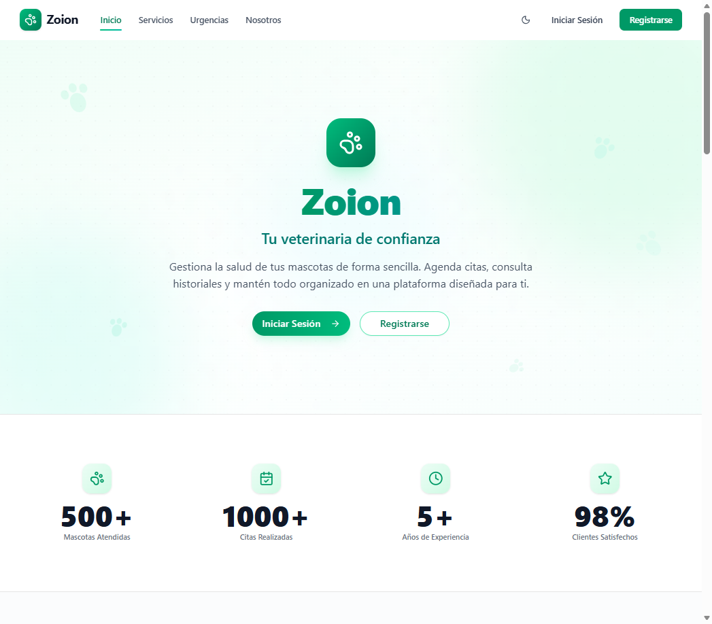
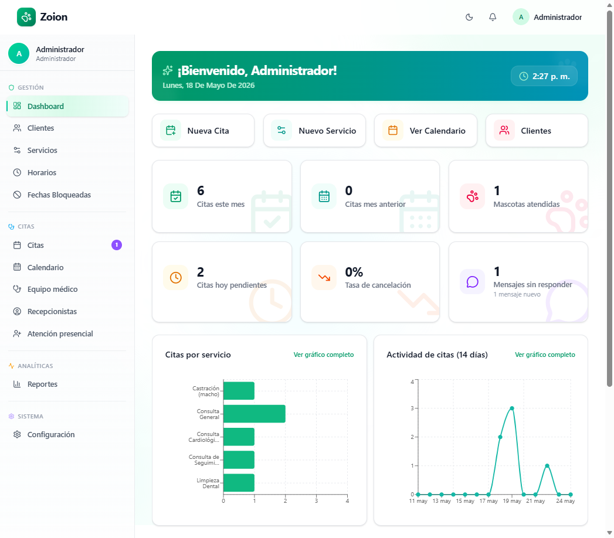
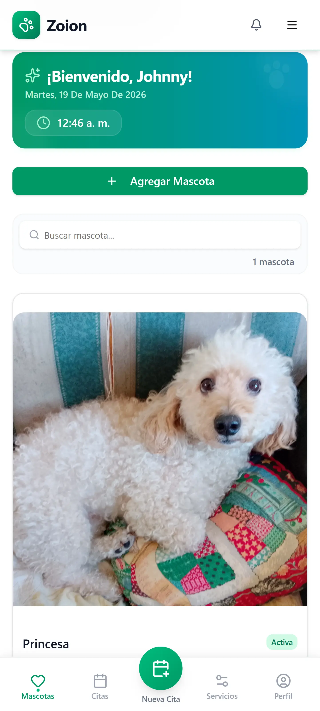
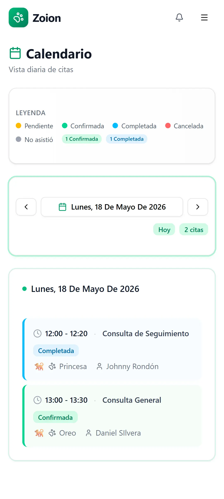

<div align="center">

# Zoion — Sistema de Gestión Veterinaria

**Plataforma de gestión veterinaria con booking inteligente, mensajería en tiempo real y control de acceso por roles.**

[](https://php.net)
[](https://laravel.com)
[](https://react.dev)
[](https://typescriptlang.org)
[](https://postgresql.org)
[](LICENSE)

</div>

---

> **El problema que resuelve:** Las clínicas veterinarias pequeñas y medianas gestionan citas por WhatsApp, llevan el historial de pacientes en papel y pierden horas coordinando entre recepción y médicos. Zoion centraliza el flujo completo: el cliente agenda en línea, el sistema asigna médico automáticamente, envía confirmaciones y recordatorios, y el médico accede al historial clínico desde su portal. Todo en un solo lugar.

---

## Vista previa

<div align="center">

  
  <br/><br/>
  
  <br/><br/>
  
  &nbsp;&nbsp;&nbsp;
  

</div>

---

## 🚀 Tecnologías Principales

| Capa | Tecnología |
|---|---|
| Backend | Laravel 13 (PHP 8.3+) |
| Frontend | React 19 + TypeScript 6 |
| Comunicación | Inertia.js |
| Estilos | Tailwind CSS 4 + shadcn/ui |
| Animaciones | Framer Motion |
| Base de Datos | PostgreSQL (principal) · MySQL · SQLite (tests) |
| Autenticación | Laravel Sanctum + verificación de email |
| Caché / Locks | Redis (producción) · driver database (desarrollo) |

---

## ✨ Módulos del Sistema

### 👨‍💻 Portal Público
- **Directorio de Servicios:** Catálogo accesible sin autenticación (`/services`) con filtrado por categorías.
- **Protocolo de Urgencias:** Panel público (`/emergency`) con instrucciones críticas de acción rápida.
- **Navegación Dinámica:** Arquitectura de *navbar* híbrida que adapta sus rutas al estado de sesión del usuario.

### 👨‍⚕️ Panel de Administración (Roles: Admin / Recepcionista)
- **Control de Acceso (RBAC):** Vistas y acciones limitadas según permisos del usuario.
- **Dashboard Inteligente:** Métricas financieras y operativas, visualización en tiempo real de citas mediante gráficos y tablas.
- **Gestión de Personal:** CRUD completo para médicos y recepcionistas, incluyendo gestión de credenciales y activación de cuentas.
- **Calendario Avanzado:** Sistema de *drag-and-drop*, gestión de fechas bloqueadas y aperturas especiales (override de disponibilidad).
- **Módulo Walk-in:** Procesamiento de citas presenciales con facturación integrada y asignación de doctores mediante *round-robin*.

### 🐕 Portal del Cliente
- **Interfaz Mobile-First:** Navegación *Bottom-Nav* optimizada para dispositivos móviles, eliminando menús redundantes.
- **Gestión de Mascotas:** Ficha clínica digital, registro de medidas (peso) e historial de vacunaciones.
- **Booking Inteligente:** *Wizard* de 3 pasos con validación estricta de solapamientos e intervalos de bloqueo de 2 horas.

### 🩺 Portal del Médico
- **Agenda Adaptativa:** Grillas responsivas (hasta 3 columnas en móviles) con KPIs de citas confirmadas, pendientes y completadas.
- **Notas Clínicas:** Sistema de registro médico persistente por mascota.

### 💬 Comunicación Centralizada
- **Mensajería Interna:** Chat en tiempo real vinculando clientes y staff (Recepcionistas/Médicos).
- **Centro de Notificaciones:** Sistema de alertas para cambios de estado en citas (aprobaciones, pagos requeridos, finalización).

---

## 🛠️ Instalación y Configuración Local

### Requisitos Previos

- PHP >= 8.3 con extensiones: `gd`, `pdo_pgsql` (o `pdo_mysql`), `redis` (opcional)
- Composer >= 2.x
- Node.js >= 20 + NPM
- PostgreSQL >= 14 (o MySQL 8)

### Pasos para el Despliegue Local

```bash
# 1. Clonar el repositorio
git clone https://github.com/johnnyarondonp-web/Zoion-sistema.git
cd Zoion-sistema

# 2. Instalar dependencias
composer install
npm install

# 3. Configurar el entorno
cp .env.example .env
```

### Configuración del archivo `.env`

```env
APP_NAME="Zoion"
APP_URL=http://localhost:8000

# Base de Datos
DB_CONNECTION=pgsql
DB_HOST=127.0.0.1
DB_PORT=5432
DB_DATABASE=zoion
DB_USERNAME=usuario
DB_PASSWORD=contraseña

# Correo (Mailtrap o SMTP local)
MAIL_MAILER=smtp
MAIL_HOST=sandbox.smtp.mailtrap.io
MAIL_PORT=2525
```

### Inicialización

```bash
php artisan key:generate
php artisan migrate --seed
php artisan storage:link
npm run build
php artisan serve
```

---

## 🧪 Pruebas Automatizadas

El proyecto emplea **PHPUnit** interactuando con SQLite en memoria.

```bash
php artisan test
```

> La suite valida la integridad de: flujos de autenticación, ciclo de vida de transacciones (Walk-in), concurrencia (race conditions en asignación de citas) y permisos RBAC.

---

## 📡 Documentación de la API

La plataforma expone endpoints REST bajo el prefijo `/api/`, gestionados mediante Laravel Sanctum.

| Prefijo | Descripción | Acceso |
|---|---|---|
| `GET /api/services/public` | Catálogo JSON de servicios activos | Público |
| `POST /api/auth/*` | Registro, verificación de sesión y tokens | Público |
| `GET/POST /api/pets` | Gestión de expedientes de mascotas | `client`, `admin` |
| `GET/POST /api/appointments` | Agendamiento, confirmación y cancelación | Autenticados |
| `GET/POST /api/admin/*` | Reportes, personal y configuraciones del sistema | `admin`, `receptionist` |
| `POST /api/walk-in/*` | Gestión de citas presenciales | `admin`, `receptionist` |

---

## ⚙️ Reglas de Negocio

### Credenciales de Prueba (Seeder)

Al ejecutar `php artisan migrate --seed`, el sistema crea automáticamente los siguientes usuarios demo completamente funcionales:

| Rol | Email | Contraseña | Notas |
|---|---|---|---|
| Administrador | `admin@zoion.app` | `password` | Acceso total al panel de control |
| Doctor Demo | `doctor@zoion.app` | `password` | Médico General Veterinario. Tiene los 7 servicios de la categoría "Consulta" asignados de forma predeterminada |
| Recepcionista Demo | `recepcion@zoion.app` | `password` | Acceso a módulos de gestión de citas, Walk-in y clientes |
| Cliente Demo | `cliente@zoion.app` | `password` | Portal de mascota y agendamiento |

> Las contraseñas de los doctores pueden configurarse vía el `.env` (`ADMIN_EMAIL`, `ADMIN_PASSWORD`). El resto de credenciales demo son fijas dentro del `DemoStaffSeeder`.

### Catálogo de Servicios Pre-cargado

El `ServiceSeeder` inicializa el sistema con **17 servicios clínicos reales** distribuidos en 4 categorías:

| Categoría | Servicios incluidos |
|---|---|
| `consulta` | Consulta General, Seguimiento, Cardiológica, Dermatológica, Oftalmológica, Extracción cuerpo extraño, Tratamiento Ocular |
| `cirugia` | Esterilización, Castración, Cirugía de Tejidos Blandos, Extracción Dental |
| `diagnostico` | Revisión Pre-quirúrgica, Electrocardiograma, Tratamiento de Piel |
| `prevencion` | Vacunación, Desparasitación, Limpieza Dental |

### Reglas Operativas del Sistema

| Regla | Descripción de Implementación |
|---|---|
| **Restricciones de Unicidad Global** | La cédula, número de teléfono y correo electrónico deben ser estrictamente únicos en todo el ecosistema (Tabla `users`) para prevenir colisiones entre roles (Doctor/Cliente/Staff). |
| **Horario Operativo** | Restricción lógica fijada de Lunes a Viernes (9:00 AM - 7:00 PM), inhabilitando transacciones automatizadas sábados y domingos. |
| **Asignación Round-Robin** | `AppointmentService::assignDoctor()` equilibra la carga delegando la cita al médico disponible con menos consultas activas en el día. |
| **Prevención de Double-Booking** | `Cache::lock($slotKey, 10)` garantiza la atomicidad de la transacción al momento de reservar un bloque de tiempo. |
| **Integridad Referencial** | Restricción de borrado (Soft/Hard delete): No se puede eliminar a clientes ni médicos con citas activas o pendientes. |

---

## 🔒 Seguridad

- **Protección de Rutas (Middleware):** Control de acceso por niveles (`admin`, `receptionist`, `doctor`, `client`).
- **Prevención Mass Assignment:** Uso riguroso de la propiedad `$fillable` en modelos de Eloquent.
- **Llaves Primarias ULID:** Mitigación de enumeración de registros utilizando identificadores lexicográficamente ordenables.
- **Sanitización Estricta:** Validación mediante `FormRequest` asegurando expresiones regulares en datos sensibles (e.g. `^\+58\d{9}$` para teléfonos).

---

## 📄 Licencia

Este proyecto está bajo la licencia **MIT**.
